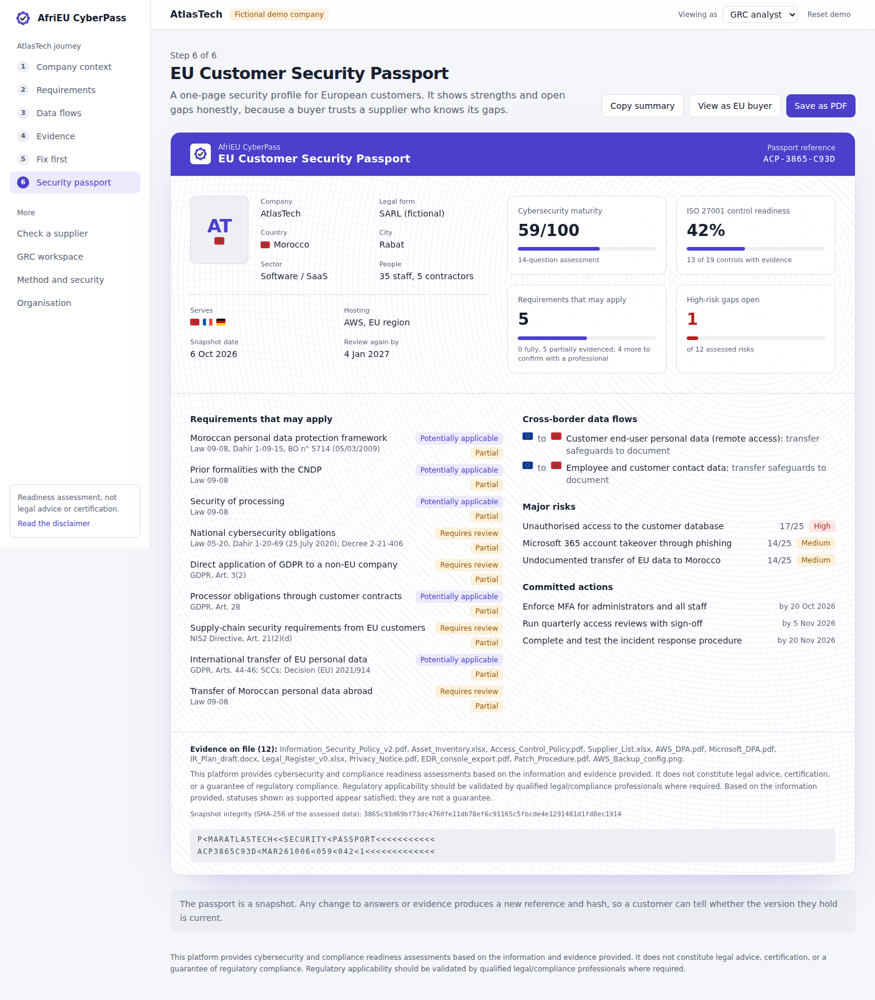

# AfriEU CyberPass

**The cybersecurity and compliance bridge between Africa and Europe.**

AfriEU CyberPass helps African companies, starting with Morocco, prove their cybersecurity and data protection to European customers. It works out which Moroccan and EU requirements may apply, checks what the company's documents actually prove, tells it what to fix first, and produces an **EU Customer Security Passport** it can share with buyers. European buyers can use the same data to assess an African supplier.

> **Live demo:** `LIVE_DEMO_URL` (no sign-up, fictional data, runs in your browser)
> **2-minute video:** `GOOGLE_DRIVE_VIEW_LINK`



---

## The problem

A Moroccan SaaS company signs a European customer. The customer sends a security questionnaire and asks about GDPR, data transfers and ISO 27001. The supplier does not know:

- which Moroccan and EU rules actually apply to it, and why;
- what evidence counts, and whether its policies are enough;
- what to fix first with a small team and budget.

Consultants are slow and expensive for SMEs. GRC platforms are built for large companies and do not understand the Morocco/EU context. Generic scanners do not understand the business.

## The solution

One workflow: **Context, Applicability, Controls, Evidence, Risk, Action, Trust.**

| Step | What the user sees |
|---|---|
| 1. Company context | Adaptive questions: markets, EU customers, data, hosting, remote access, special status |
| 2. Requirements | Morocco, EU and cross-border rules, each marked *Potentially applicable*, *Requires review* or *Not applicable*, with condition, reason, confidence, source and date checked |
| 3. Data flows | Where data is stored and accessed from; potential international transfers flagged |
| 4. Evidence | PDF analysed in the browser; *Supported*, *Partially supported*, *Not demonstrated* or *Irrelevant*, with what was found and what is missing |
| 5. Fix first | One-sentence CEO summary, top 3 actions, 30/60/90-day plan |
| 6. Passport | Shareable, printable profile with a SHA-256 snapshot fingerprint |
| Buyer view | Supplier risk rating and a tailored evidence request |

## What makes it different

- **Explicit applicability logic.** An EU customer never switches everything on. GDPR territorial scope (Art. 3(2)), processor contracts (Art. 28) and international transfers (Chapter V) are evaluated as separate rules. Example: AtlasTech is a B2B processor, so GDPR reaches it mainly through contracts and transfers, and Art. 3(2) is flagged for review rather than assumed.
- **Policy is not implementation.** The evidence engine separates written rules ("design") from proof they run ("operation"). A policy alone can never be "supported".
- **Two-sided trust.** The same data serves the African supplier (passport) and the European buyer (supplier risk and evidence request).
- **Honest by design.** No "you are compliant" statements; every legal record carries source, date checked and verification status.

## Features in this MVP

- 13 legal requirements (Morocco: Law 09-08, CNDP formalities, Law 05-20, DNSSI; EU: GDPR Arts. 3(2), 27, 28, Chapter V, NIS2, DORA) with explicit rules
- 19 ISO/IEC 27001:2022 Annex A controls mapped to NIST CSF 2.0
- 12-risk register using ISO 27005 logic (likelihood x impact, evidence-based control effectiveness, residual risk)
- 14-question cybersecurity maturity assessment (0-100, published formula)
- In-browser PDF evidence analysis with prompt-injection detection and human validation
- Cross-border data-flow analysis with an "add a flow" form
- Prioritised remediation (top 3 plus 30/60/90 days)
- EU Customer Security Passport (print to PDF, snapshot hash)
- Supplier risk mode for EU buyers
- GRC workspace: risk register, control and evidence matrix, applicability matrix, NIST view, assessment, audit trail
- Role preview (GRC analyst, Executive, Auditor) and role-permission matrix
- Light and dark themes, responsive down to mobile

## Architecture

The MVP is a **static single-page app**: React 18, TypeScript, Tailwind CSS, built with Vite. All logic runs in the browser and demo data is kept in the visitor's localStorage. This is deliberate for a public competition demo: no server to attack, no uploads leaving the device, no cost per visitor.

```
src/
  data/        legal.ts (legal knowledge base + rules), controls.ts (ISO/NIST), atlastech.ts (demo org), samples.ts (embedded PDFs)
  engine/      core.ts (applicability, risk, prioritisation, scoring, flows, supplier), evidence.ts (analyser), pdf.ts (extraction), types.ts
  pages/       one file per screen
  components/  UI primitives and app shell
docs/          ARCHITECTURE.md, schema.sql (target PostgreSQL schema), DEMO_SCRIPT.md, PITCH_DECK.md, BUSINESS.md, NAMING.md, SCREENS.md
samples/       fictional evidence PDFs used in the demo
```

Deterministic code decides every status, score and priority. Text analysis only proposes findings, which a person validates. The production target (FastAPI, PostgreSQL with row-level security, AI provider abstraction, server-side RBAC) is specified in [docs/ARCHITECTURE.md](docs/ARCHITECTURE.md) and [docs/schema.sql](docs/schema.sql).

## Local setup

Requirements: Node.js 20 or 22.

```bash
npm ci
npm run dev          # http://localhost:5173
npm test             # 16 tests: legal data quality, applicability, risk, evidence on real PDFs, flows, supplier
npm run build        # static site in dist/
npm run build:single # one self-contained HTML file in dist-single/index.html
```

Environment variables: none needed for the MVP. See `.env.example` for the target architecture.

Database setup: not needed for the MVP. `docs/schema.sql` is the target PostgreSQL schema (`psql -f docs/schema.sql`).

Seed data: the AtlasTech organisation, 13 legal requirements, 19 controls, 12 risks, 12 actions, 14 questions, 6 data flows and 4 sample PDFs load automatically. Use **Reset demo** in the top bar to return to the original state. Regenerate the sample PDFs with `npm run samples` (needs Python 3 and reportlab).

## Deployment

**GitHub Pages (recommended, free):** push to `main`, then in the repository go to Settings > Pages > Source: GitHub Actions. The workflow in `.github/workflows/deploy.yml` runs the tests, builds and publishes. URL: `https://YOUR-USERNAME.github.io/afrieu-cyberpass/`.

**Vercel or Netlify:** import the repository; framework preset Vite, build command `npm run build`, output directory `dist`.

**Docker:**
```bash
docker compose up --build   # http://localhost:8080, unprivileged nginx with security headers and CSP
```

**Anywhere:** `dist-single/index.html` works from any static host, or opened directly from disk.

## Security

The product is a security product, so it is held to that standard. Full threat model on the in-app *Method and security* page and in [docs/ARCHITECTURE.md](docs/ARCHITECTURE.md).

- Uploaded files are parsed in the browser and never transmitted. PDF magic-byte check, 5 MB and 40-page limits, pdf.js with `isEvalSupported: false`.
- Instruction-like text in documents is detected, shown to the user and excluded from scoring (tested).
- No `dangerouslySetInnerHTML`; user text inputs are length-limited and stripped of angle brackets; external links use `rel="noopener noreferrer nofollow"`.
- Docker image: unprivileged nginx, read-only filesystem, strict CSP and security headers.
- Analyser findings change nothing until a person validates them; every change is written to the audit trail.

## 2-Minute Demo

Before recording: open the live demo, click **Reset demo** in the top bar, use a 1440 x 900 browser window, light theme, zoom 100%.

| Time | Screen | Click | Say (summary) |
|---|---|---|---|
| 0:00 | Landing | none | The problem: a Moroccan SME must prove its security to a European customer |
| 0:15 | Company context | "Try it as AtlasTech, a Moroccan SaaS"; scroll to "Where data lives"; switch off then on "Can staff in Morocco access that data?" | Context drives the result |
| 0:40 | Requirements | sidebar "Requirements"; the transfer card is open | Morocco, EU, cross-border; reasons and sources |
| 0:55 | Evidence | sidebar "Evidence"; sample "Access_Control_Policy.pdf"; "Validate and apply to controls" | Partially supported; MFA and review records missing; risk 20 to 17 |
| 1:15 | Fix first | "See what to fix first" | Largest exposure; fix these 3 first |
| 1:35 | Passport | "Generate the security passport" | Scores, requirements, flows, gaps, fingerprint |
| 1:50 | Supplier | "View as EU buyer" | Same data, buyer view; closing line |

Exact narration and storyboard: [docs/DEMO_SCRIPT.md](docs/DEMO_SCRIPT.md).

## Legal disclaimer

This platform provides cybersecurity and compliance readiness assessments based on the information and evidence provided. It does not constitute legal advice, certification, or a guarantee of regulatory compliance. Regulatory applicability should be validated by qualified legal/compliance professionals where required.

Legal records marked *Re-verify before reliance* were checked through reputable secondary sources on 2026-10-06; Moroccan article numbers are intentionally left blank until checked against the Bulletin Officiel. AtlasTech is fictional.

## Licensing

MIT. Third-party components and attributions: [LICENSES.md](LICENSES.md).
